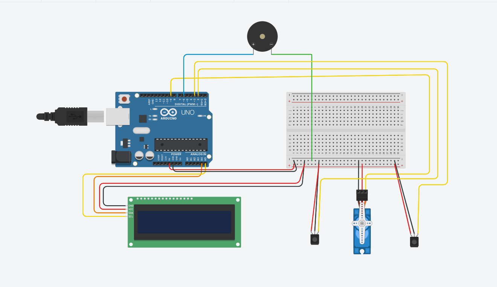

# 🚗 Smart Parking System with Automated Gate Control

## 📌 Overview

This project is an Arduino-based smart parking system designed to efficiently manage parking space usage.

It detects vehicle entry and exit using IR sensors, updates available parking slots in real time, and controls a gate using a servo motor. The system also provides visual feedback through an LCD display and audio alerts using a buzzer.

---

## 🎯 Key Features

* 🚗 Automatic vehicle detection (Entry & Exit)
* 🅿️ Real-time parking slot tracking
* 🚧 Servo-controlled automatic gate
* 📟 LCD display with dynamic messages
* 🔊 Buzzer alerts for entry, exit, and full condition
* ⏱️ Non-blocking timing using millis()

---

## 🧰 Components Used

* Arduino Uno (ATmega328P)
* IR Sensors (2)
* Servo Motor
* 16x2 I2C LCD Display
* Buzzer
* Breadboard
* Jumper wires
* Power supply

---

## 🔌 Pin Configuration

| Component         | Arduino Pin        |
| ----------------- | ------------------ |
| IR Sensor (Entry) | D3                 |
| IR Sensor (Exit)  | D4                 |
| Servo Motor       | D9                 |
| Buzzer            | D6                 |
| LCD (I2C)         | SDA (A4), SCL (A5) |

---

## 🧠 System Architecture

**Sensors → Arduino → Actuators & Display**

* IR Sensors detect vehicle movement
* Arduino processes slot availability
* Servo motor controls gate
* LCD displays status
* Buzzer gives alerts

---

## 🔌 Circuit Diagram



---

## ⚙️ Working Principle

### 🚗 Vehicle Entry

* Entry sensor detects vehicle
* Slot count decreases
* Gate opens automatically
* LCD shows "WELCOME"

---

### 🚙 Vehicle Exit

* Exit sensor detects vehicle
* Slot count increases
* Gate opens
* LCD shows "THANK YOU"

---

### 🚫 Parking Full Condition

* If slots = 0
* Entry is blocked
* LCD shows "PARKING FULL"
* Long buzzer alert

---

### 🚧 Gate Control Logic

* Gate opens for a fixed time
* Automatically closes after delay
* System uses cooldown to prevent multiple triggers

---

## 📟 Display System

LCD shows:

* Available slots (SLOTS = X)
* Status: Available / FULL
* Temporary messages (WELCOME, THANK YOU, FULL)

---

## 📊 Core Logic (Code)

```cpp
bool entryDetected = (entry == LOW);
bool exitDetected  = (exit == LOW);

if (entryDetected && slots > 0) {
    slots--;
}
else if (exitDetected && slots < maxSlots) {
    slots++;
}
```

---

## 🧪 Sample Output

| Slots | Condition    | Action        |
| ----- | ------------ | ------------- |
| 4     | Car enters   | Slots → 3     |
| 1     | Car exits    | Slots → 2     |
| 0     | Parking Full | Entry blocked |

---

## 🚀 Future Enhancements

* 📡 IoT-based parking monitoring
* 📱 Mobile app integration
* 🪪 RFID / number plate recognition
* 🏢 Multi-level parking system
* 💾 EEPROM storage for slot persistence

---

## ⭐ Conclusion

This project demonstrates how embedded systems can automate parking management using simple sensors, real-time processing, and efficient control logic. It improves user convenience and optimizes space utilization.


